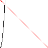

# 一个利用Canvas显示函数图像的一个js库 (目前还是垃圾)

## 演示
代码中的`ca`是一个边长为100的Canvas.  
``` js
function f(x) {
    return x * x;
}
function f2(x) {
    return 100-x;
}
const ca = document.getElementById("c");
var d = new DrawFunc(ca, 100, 100);
d.drawFunc(f);
d.drawFunc(f2, [255, 0, 0, 255]);
d.updateCanvas();
```
显示的图片：  

## TODO
- [x] 画点
- [x] ~~连线~~  
- [ ] ~~对连线的优化~~
  > 不连线了, 连线一点都不好玩 😅.
- [x] 实现简单函数图像的绘制(但不美观, 且只有正半轴)
- [ ] 坐标轴的显示
- [ ] 函数的放大缩小
- [ ] 显示位置的移动
- [x] 清空
- [ ] 多值函数的显示 

## ~~问题~~ 特性
~~绘制的图像稍微大一点加载就很慢（差不多400x400像素就可以卡了）~~  
